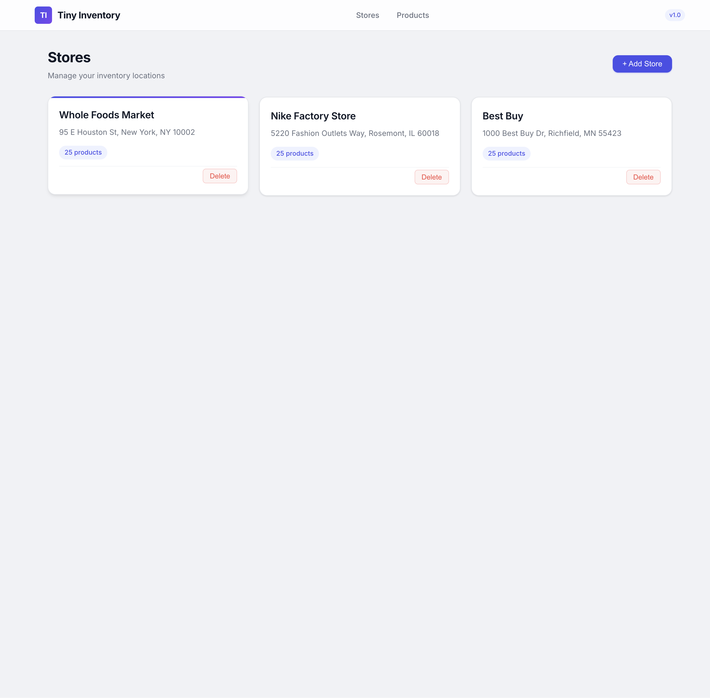
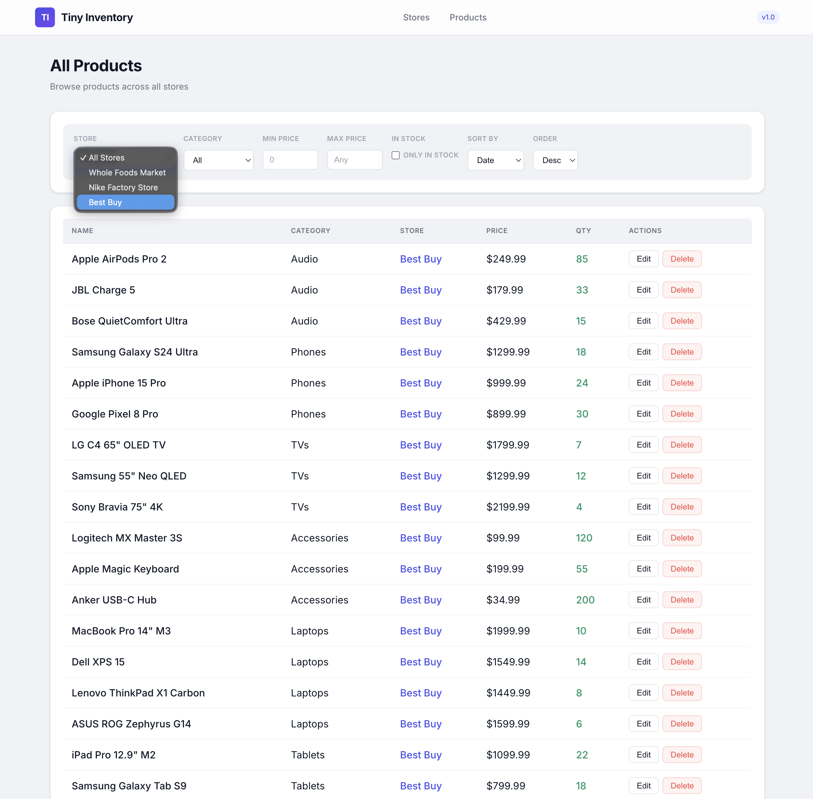
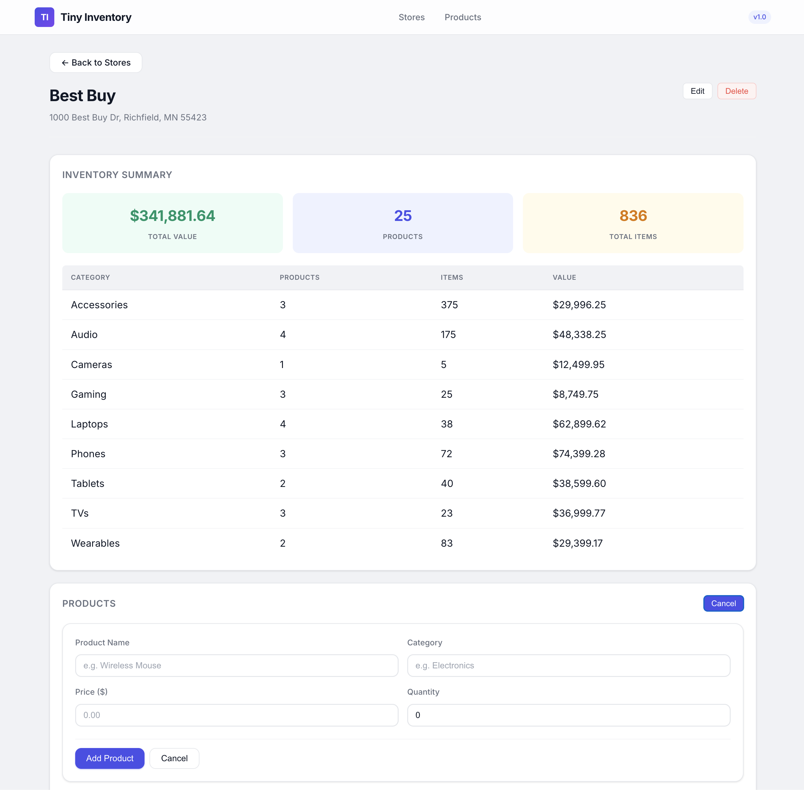
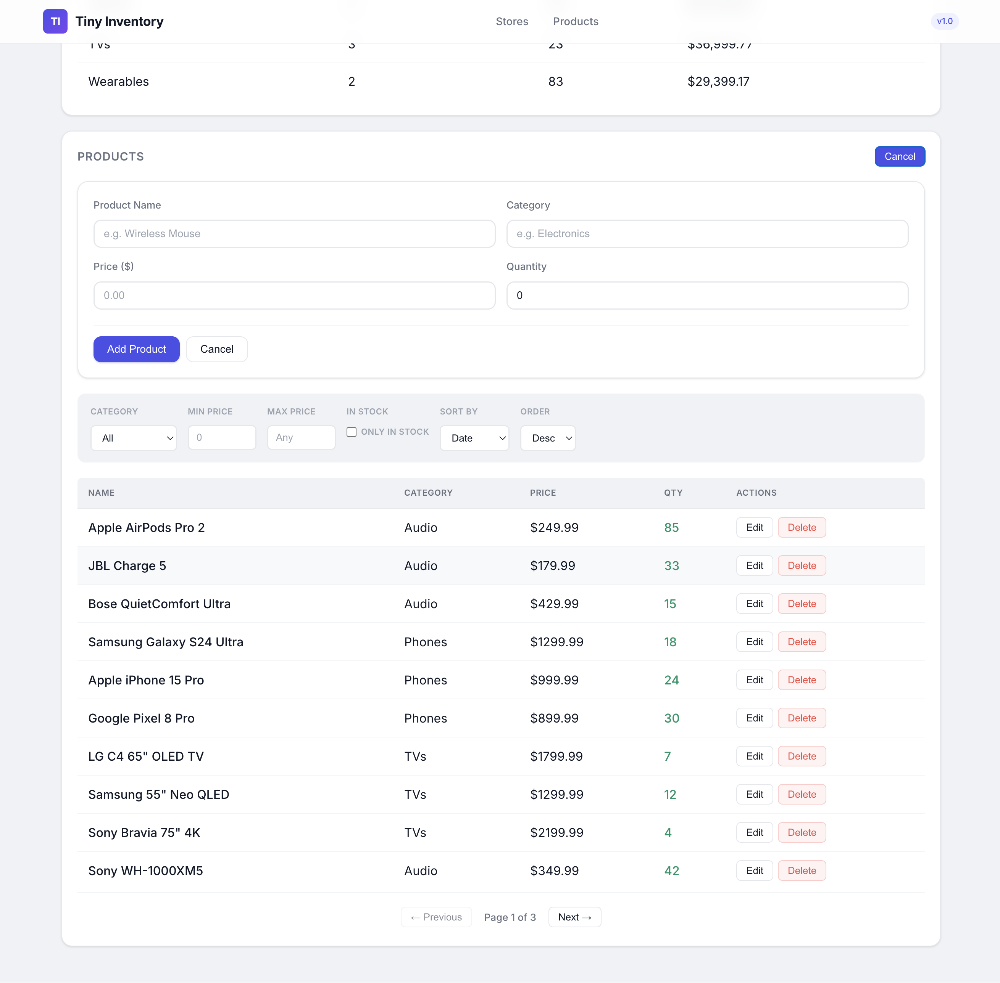

# Tiny Inventory

> Full-stack inventory management system that tracks stores and the products they carry.

**Tech stack:** Express.js | React 19 | TypeScript | PostgreSQL | Prisma 7 | Docker

---

## Screenshots

| Store List | All Products |
|:---:|:---:|
|  |  |

| Store Detail — Inventory Summary | Store Detail — Products |
|:---:|:---:|
|  |  |

---

## Architecture

```
┌──────────┐      ┌──────────────┐      ┌────────────┐
│  React   │ ───> │  Express API │ ───> │ PostgreSQL │
│  (nginx) │ :3000│  (Node.js)   │ :4000│            │ :5432
└──────────┘      └──────────────┘      └────────────┘
```

Three Docker containers orchestrated by Compose:

| Component | Description |
|-----------|-------------|
| **PostgreSQL** | Two tables (`Store`, `Product`) with cascade deletes, `Decimal(10,2)` prices, UUID primary keys |
| **Server** | REST API with Zod validation, centralized error handling, Swagger docs, graceful shutdown. Seeds sample data on startup |
| **Web** | SPA with three screens — store list, store detail (inventory + products), and global product browser. nginx proxies `/api/*` to the server |

Health checks ensure ordered startup: PostgreSQL -> Server -> Web.

---

## Quick Start

> Prerequisite: [Docker Desktop](https://www.docker.com/products/docker-desktop/)

```bash
cp .env.example .env          # defaults work out of the box
docker compose up --build     # builds everything, seeds 3 stores + 75 products
```

| Service      | URL                           |
|--------------|-------------------------------|
| Frontend     | http://localhost:3000          |
| API          | http://localhost:4000/api      |
| API Docs     | http://localhost:4000/api/docs |

To reset: `docker compose down -v && docker compose up --build`

### Local Development

<details>
<summary>Expand for local setup instructions</summary>

#### Prerequisites

- **Node.js 20+** — https://nodejs.org/
- **PostgreSQL 16+**

  **macOS:** `brew install postgresql@16 && brew services start postgresql@16`

  **Ubuntu:** `sudo apt install postgresql-16 && sudo systemctl start postgresql`

  **Windows:** https://www.postgresql.org/download/windows/

#### Create the database

```bash
psql -U postgres
```
```sql
CREATE USER app WITH PASSWORD 'changeme';
CREATE DATABASE tiny_inventory OWNER app;
\q
```

#### Start the application

```bash
npm install                           # install all workspace dependencies
cp .env.example .env                  # configure root env
cd server && cp .env.example .env     # configure server env
npx prisma generate                   # generate Prisma client
npx prisma migrate deploy             # apply migrations
cd ..
npm run seed                          # seed sample data (3 stores, 75 products)
npm run dev                           # starts server (:4000) + web (:3000)
```

</details>

### Tests

```bash
npm test                              # 90 server tests (unit + integration)
npm test -w web                       # 58 frontend unit tests
```

See [`server/README.md`](server/README.md) and [`web/README.md`](web/README.md) for project-specific details.

---

## API

```
GET    /api/stores                       List stores (with product counts)
POST   /api/stores                       Create store
GET    /api/stores/:id                   Get store
PUT    /api/stores/:id                   Update store
DELETE /api/stores/:id                   Delete store (cascades products)
GET    /api/stores/:id/inventory         Aggregated inventory by category
GET    /api/stores/:id/products          List products (filtered, paginated)
POST   /api/stores/:id/products          Create product
GET    /api/products                     List all products across stores
GET    /api/products/:id                 Get product (includes parent store)
PUT    /api/products/:id                 Update product
DELETE /api/products/:id                 Delete product
```

**Filtering & pagination** on product list endpoints: `?category=`, `?minPrice=&maxPrice=`, `?inStock=true`, `?page=&limit=`, `?sortBy=price&order=asc`. The global `GET /api/products` also supports `?storeId=`.

**Non-trivial operation** — `GET /api/stores/:id/inventory` returns total inventory value, product/item counts, and a per-category breakdown. Computed entirely in PostgreSQL via a single `GROUPING SETS` query:

```sql
SELECT category,
       COUNT(*)                           AS product_count,
       COALESCE(SUM(quantity), 0)         AS item_count,
       COALESCE(SUM(price * quantity), 0) AS total_value
FROM   "Product"
WHERE  "storeId" = $1
GROUP BY GROUPING SETS ((category), ())
```

Full interactive docs at [`/api/docs`](http://localhost:4000/api/docs) (Swagger UI).

---

## Decisions & Trade-offs

| Decision | Rationale | Trade-off |
|----------|-----------|-----------|
| **Centralized error handler** | `AppError` hierarchy + `asyncHandler` wrapper. Prisma P2025 caught in one place. Consistent error responses across all routes | — |
| **Zod validation middleware** | Reusable `validate(schema)` per route. Shared schemas across files. Invalid requests rejected before hitting the database | — |
| **Graceful shutdown** | `SIGTERM`/`SIGINT` -> stop connections -> drain -> disconnect Prisma -> force-exit at 10s. Production-ready for Docker/Kubernetes | — |
| **Multi-stage Docker** | Production image has only compiled JS + prod deps. Non-root user, health check. Minimal attack surface | Longer build time |
| **Prisma 7 + `@prisma/adapter-pg`** | Type-safe queries, auto-generated migrations, seed workflow. V7 uses standard `pg` driver | Larger dependency tree than raw SQL |
| **Swagger UI (OpenAPI 3.0)** | Interactive API docs at `/api/docs`. Spec defined in code (`swagger.ts`), no build step needed | — |
| **UUIDs for primary keys** | Non-sequential, globally unique, safe in URLs. Prevents enumeration | Slightly larger indexes than integers |
| **`Decimal(10,2)` for prices** | Avoids floating-point rounding (`49.99 * 3 = 149.97`, not `149.969...`) | — |
| **Offset pagination** | Simple implementation, adequate for inventory scale | Degrades on deep pages |
| **CSS Modules** | Scoped styles, zero runtime, no UI framework dependency | More CSS by hand |
| **Seed on every startup** | `docker compose up` gives populated DB immediately | Re-seeds on restart; production would gate behind env flag |

---

## Testing Approach

**148 tests total** — 90 server (24 unit + 66 integration) + 58 frontend. All use **Vitest**.

### Server — unit tests (24)

Pure logic, no database or HTTP:

- **Zod schemas** (11) — valid input, boundary values, type coercion, unknown field stripping
- **Validation middleware** (6) — passthrough, structured 400 errors, non-Zod error forwarding
- **Error handler** (7) — `AppError`/`NotFoundError` mapping, Prisma P2025, 500 fallback, `asyncHandler`

### Server — integration tests (66)

Real HTTP via **Supertest** + real PostgreSQL:

- **Store CRUD** (15) — full lifecycle, validation rejection, cascade delete, 404 handling
- **Inventory aggregation** (4) — category breakdown, empty store, zero-quantity products
- **Store products** (6) — create in store, validation, 404 for missing store
- **Product CRUD** (9) — full lifecycle, validation, 404 on all operations
- **Filtering & pagination** (25) — category, price range, in-stock, combined filters, pagination, sorting
- **Global product listing** (6) — cross-store results, storeId filter, pagination
- **Health check** (1)

### Frontend — unit tests (58)

**Testing Library + jsdom**, all API calls mocked:

- **API client** (15) — all fetch calls, query params, error extraction
- **StoreForm / ProductForm** (17) — render, validation, submission, error display
- **App routing** (4) — correct page per route
- **StoreList** (9) — loading, empty, error states, create/delete flows
- **StoreDetail** (13) — inventory summary, product table, edit/add/delete, navigation

### Why this split

Route handlers are thin wrappers around Prisma — mocking the ORM provides no real confidence. Integration tests verify the full stack in one pass. Unit tests cover middleware and validation logic that doesn't need a database. Frontend components are tested with mocked API calls to isolate rendering from the server.

---

## If I Had More Time

### Backend

- **Structured logging and distributed tracing** — `pino-http` for request logging, OpenTelemetry for traces, hooked into Datadog / Grafana (Tempo + Loki) / CloudWatch
- **Rate limiting** — `express-rate-limit` with per-endpoint limits and 429 responses
- **Authentication** — JWT auth with per-user store ownership and row-level access control
- **Cursor-based pagination** — UUID cursors for stable, performant pagination at any depth
- **CORS restrictions** — currently using open `cors()` policy (nginx proxies all traffic so it's same-origin in production). A public API would need origin restrictions via `CORS_ORIGIN` env var

### Frontend

- **Optimistic UI** — instant mutations without waiting for server round-trips
- **React Query** — server state caching, background refetch, automatic invalidation
- **Accessibility audit** — axe-core, keyboard navigation, ARIA labels, focus management
- **Responsive design** — mobile breakpoints and touch interactions

### Shared

- **Playwright E2E tests** — full browser flow covering the gaps between unit and integration tests
- **CI/CD with GitHub Actions** — lint, type-check, test, build, push Docker images on every PR
- **API versioning** — `/api/v1/` prefix for non-breaking evolution
